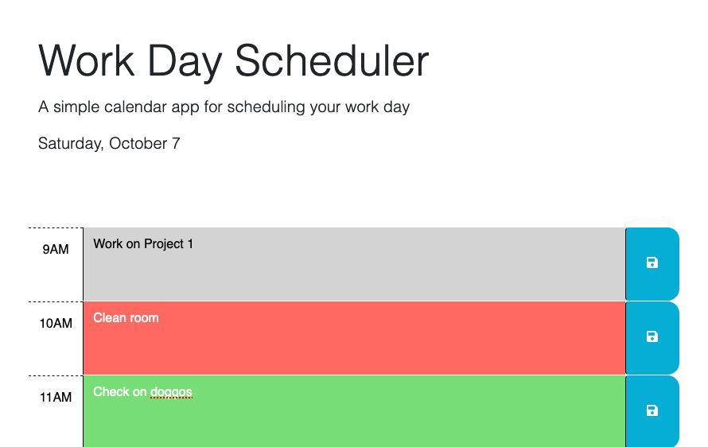

# Work Day Scheduler
Work day scheduler application. Stay on track with your duties using the Work Day Scheduler! View your agenda in blocks of time!

Start scheduling your day here: [https://elmfer.github.io/work-day-scheduler/](https://elmfer.github.io/work-day-scheduler/)

### Features
* Displays the current day at the top
* Lists all the work hours of the day
* Set an agenda on a specific hour
* Schedule presists on local storage
* Schedule automatically clear upon loading it the next day

### Screenshot

### What I learned
* I learned how to use jQuery for quickly referencing and creating elements in the DOM
* I learned how to use dayjs for dealing with time and dates
* I practiced on reading documention for utilizing 3rd-party APIs